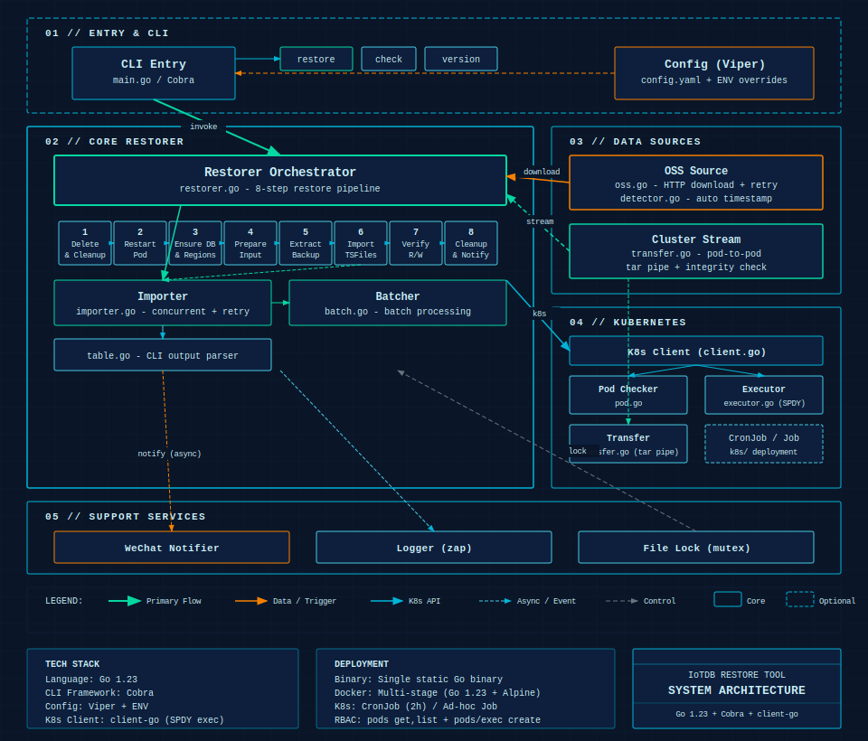

# IoTDB 数据库恢复工具

用 Go 语言重构的 IoTDB 数据库恢复工具，用于从 OSS 下载备份文件并恢复到 Kubernetes 集群中的 IoTDB 数据库。

## 系统架构



## 功能特性

- ✅ 自动检测备份文件时间戳（支持秒数 01-10）
- ✅ 从 OSS 下载备份文件（支持断点续传）
- ✅ 并发导入 tsfile 文件（可配置并发数和批次大小）
- ✅ 企微通知（恢复完成自动发送）
- ✅ 结构化日志（zap）
- ✅ 配置文件支持（YAML）
- ✅ Docker 镜像支持
- ✅ Kubernetes Job/CronJob 支持

## 快速开始

### 本地运行

```bash
# 构建
make build

# 运行
./bin/iotdb-restore restore -t 20260203083502

# 检查 Pod 状态
./bin/iotdb-restore check

# 查看帮助
./bin/iotdb-restore --help
./bin/iotdb-restore restore --help
```

### Docker 运行

```bash
# 构建镜像
make docker

# 运行
docker run --rm \
  -v ~/.kube/config:/root/.kube/config:ro \
  -v ./config.yaml:/etc/iotdb-restore/config.yaml:ro \
  iotdb-restore:latest \
  restore -t 20260203083502
```

### Kubernetes Job

```bash
# 创建 ConfigMap 和 RBAC
kubectl apply -f deployments/k8s/

# 创建 Job 执行恢复
kubectl create job iotdb-restore-$(date +%s) \
  --from=cronjob/iotdb-restore
```

## 配置

配置文件示例 (`configs/config.yaml`)：

```yaml
kubernetes:
  namespace: iotdb
  pod_name: iotdb-datanode-0
  kubeconfig: ~/.kube/config

iotdb:
  data_dir: /iotdb/data
  cli_path: /iotdb/sbin/start-cli.sh
  host: iotdb-datanode

backup:
  source_type: oss
  base_url: https://iotdb-backup.oss-accelerate.aliyuncs.com/ems-au
  download_dir: /tmp
  auto_detect_timestamp: true
  source_namespace: ems-au
  source_pod_name: iotdb-datanode-0
  source_data_dir: /iotdb/data/datanode
  staging_dir: /iotdb/data/restore_staging
  archive_dir: /tmp

import:
  concurrency: 1
  batch_size: 3
  retry_count: 3
  batch_delay: 3

notification:
  wechat:
    webhook_url: https://qyapi.weixin.qq.com/cgi-bin/webhook/send?key=xxx
    enabled: true
  environment: EMS-AU
  enabled: true

log:
  level: info
  format: console
```

## 命令行参数

### 全局参数

- `-c, --config`: 配置文件路径（默认: `configs/config.yaml`）
- `-n, --namespace`: Kubernetes 命名空间（覆盖配置文件）
- `-p, --pod-name`: Pod 名称（覆盖配置文件）
- `-d, --debug`: 调试模式

### restore 命令

```bash
iotdb-restore restore [flags]

Flags:
  -t, --timestamp string   备份文件时间戳（如：20260203083502）
      --concurrency int    并发数（覆盖配置文件）
      --batch-size int     批次大小（覆盖配置文件）
      --dry-run            干运行模式（仅检查，不执行）
      --skip-delete        跳过删除现有数据库
```

### check 命令

```bash
iotdb-restore check [flags]

检查 Kubernetes Pod 的运行状态和连接性
```

## 使用示例

### 1. 自动检测时间戳并恢复

```bash
./bin/iotdb-restore restore
```

自动检测当前小时的 35 分 01-10 秒的备份文件。

### 2. 同集群直连恢复

```yaml
backup:
  source_type: cluster_stream
  source_namespace: ems-au
  source_pod_name: iotdb-datanode-0
  source_data_dir: /iotdb/data/datanode
  staging_dir: /iotdb/data/restore_staging
  archive_dir: /iotdb/data/restore_archive
```

```bash
./bin/iotdb-restore restore
```

该模式会直接从源 Pod 流式拉取 `data/sequence` 和 `data/unsequence`，先在目标 Pod 的 `archive_dir` 落成临时 tar，校验完整性后再解包到 `staging_dir`，最后导入其中的 `*.tsfile`。不会恢复 `system`、`consensus`、`wal`，且会忽略 `timestamp` 参数。大数据量场景建议把 `archive_dir` 指到有充足空间的挂载盘，而不是容器 `/tmp`。

### 3. 指定时间戳恢复

```bash
./bin/iotdb-restore restore -t 20260203083502
```

### 4. 自定义并发数和批次大小

```bash
./bin/iotdb-restore restore -t 20260203083502 --concurrency 2 --batch-size 50
```

### 5. 干运行（仅检查，不执行）

```bash
./bin/iotdb-restore restore -t 20260203083502 --dry-run
```

### 6. 调试模式

```bash
./bin/iotdb-restore restore -t 20260203083502 --debug
```

## 项目结构

```
iotdb-restore-tool/
├── cmd/
│   └── iotdb-restore/
│       └── main.go                 # 应用入口（Cobra 命令）
├── pkg/
│   ├── config/                     # 配置管理
│   │   ├── config.go               # 配置结构体
│   │   └── loader.go               # Viper 加载器
│   ├── k8s/                        # Kubernetes 集成
│   │   ├── client.go               # client-go 初始化
│   │   ├── pod.go                  # Pod 操作
│   │   └── executor.go             # 命令执行器
│   ├── downloader/                 # 下载器
│   │   ├── oss.go                  # OSS 下载
│   │   └── detector.go             # 时间戳检测
│   ├── restorer/                   # 恢复核心逻辑
│   │   ├── restorer.go             # 恢复流程
│   │   ├── importer.go             # Tsfile 导入
│   │   └── batch.go                # 批次处理
│   ├── notifier/                   # 通知模块
│   │   ├── wechat.go               # 企微通知
│   │   └── message.go              # 消息构建
│   └── logger/                     # 日志模块
│       └── logger.go               # zap 日志
├── configs/
│   └── config.yaml                 # 默认配置
├── deployments/
│   ├── Dockerfile                  # 多阶段构建
│   └── k8s/
│       ├── rbac.yaml               # RBAC 权限
│       ├── configmap.yaml          # ConfigMap
│       └── job.yaml                 # Job 模板
├── go.mod
├── go.sum
├── Makefile
└── README.md
```

## 开发

### 安装依赖

```bash
make deps
```

### 运行测试

```bash
make test
```

### 代码检查

```bash
make fmt
make vet
```

## Docker 部署

### 构建镜像

```bash
make docker
```

### 推送到镜像仓库

```bash
make docker-push
```

## 企微通知示例

恢复完成后会自动发送 Markdown 格式的企微通知：

```markdown
## IoTDB 数据恢复通知

> **环境**: EMS-AU
> **备份文件**: `emsau_iotdb-datanode-0_20260203083502.tar.gz`

---

### 📊 恢复统计

| 项目 | 详情 |
|------|------|
| **开始时间** | 2026-02-03 11:35:01 |
| **结束时间** | 2026-02-03 12:42:43 |
| **执行时长** | 1小时7分42秒 |
| **总文件数** | 521 个 |
| **成功导入** | 521 个 |
| **失败数量** | 0 个 |

---

### ✅ 恢复操作已完成

系统时间: 2026-02-03 12:42:43
```

## 技术栈

- **语言**: Go 1.23
- **命令行**: Cobra
- **配置**: Viper
- **Kubernetes**: client-go
- **日志**: zap
- **HTTP**: net/http

## 与 Bash 脚本对比

| 特性 | Bash 脚本 | Go 程序 |
|------|----------|---------|
| Kubernetes 交互 | kubectl 命令 | client-go |
| 并发控制 | xargs + flock | goroutine + channel |
| 错误处理 | set -e | 结构化错误 + 重试 |
| 配置管理 | 硬编码变量 | Viper 多源配置 |
| 日志 | echo | zap 结构化日志 |
| 部署 | 脚本文件 | 单一二进制 + Docker |

## License

Copyright © 2025 
